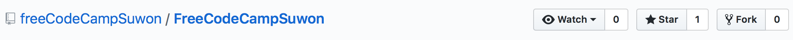

# FreeCodeCampSuwon

Activities in Free Code Camp Suwon

Hackathons, studies, projects are welcome are posted here.

## How to get news feed

[Join our slack channel #freecodecamp_repo](https://freecodecampsuwon.slack.com/shared_invite/MTgxNDI0MDgwMTgzLTE0OTQzMDQxNDUtYTE0MDhjYjJmYQ)

* Watch : Get notification for any updates on this repository
* Star : Add to favorites
* Fork : copy repository to personal account, and you send changes of the file with pull request

## Projects

Projects that Free Code Camp provides or others
* [05.09 ~ 05.12] [Bulletin board with MVC architecture on JSP]()
  - Developers
    - [Hyungsuk Kang](https://github.com/hskang9)
    - [Jin Sun](https://github.com/sj602)

## Study

* [05.09] [Java Servlet Page(JSP)](https://www.udemy.com/jsp-servlet-free-course/)
  - Prerequisite
      - Eclipse(Java EE edition)
      - Apache Tomcat Server v.6~9

* [05.12] [React](https://www.udemy.com/react-redux/)

## Hackathons (2017)

* [~ 05.11 11:00] [NAVER HACK DAY](https://form.office.naver.com/form/responseView.cmd?formkey=OGVjMDAxZDQtMjRmZC00Njk0LWJiMjEtNWIxN2U1YmY3N2Fh&sourceId=urlshare)
